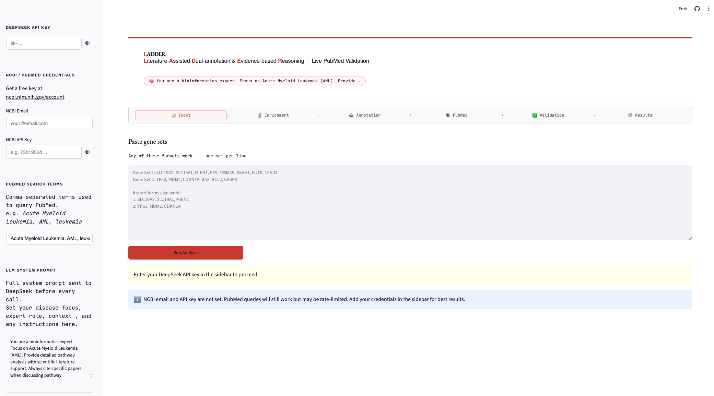

# 🧬 LADDER · Gene Set Annotator

**L**iterature-**A**ssisted **D**ual-annotation & **D**ocumentation, **E**vidence-based **R**easoning

LADDER is an LLM-powered gene set dual-annotation pipeline that names the biological process behind a gene set, validates that annotation against live PubMed literature, and reports a confidence score — with full transparency into supporting papers, journal quality, and any conflicting evidence found along the way.

<p align="center">
  <a href="https://ladder-app.streamlit.app/"><b>🔗 Try the live app</b></a>
  ·
  <a href="#installation">Run it locally</a>
  ·
  <a href="#how-it-works">How it works</a>
</p>

<p align="center">
  
</p>

---

## Overview

Paste in one or more gene sets (e.g. output from a community-detection / co-expression clustering step) and LADDER will, for each set:

1. Run **functional enrichment** (GO, Reactome, KEGG via `gseapy`/Enrichr)
2. Ask an LLM to generate two candidate biological process annotations: (i) a direct LLM annotation based solely on the gene set, and (ii) an enrichment-driven LLM annotation grounded in functional enrichment results.
3. Pull **live PubMed literature** for the genes in that set
4. **Validate** both proposed processes strictly against the retrieved papers, producing an updated, evidence-grounded confidence score and flagging any conflicting evidence
5. Surface everything — genes, pathways, papers, citations, raw LLM output — in an inspectable UI, exportable as CSV

## Features

- **Dual annotation** — process naming is proposed both with (i) a direct LLM annotation based solely on the gene set, and (ii) an enrichment-driven LLM annotation grounded in functional enrichment results.
- **live PubMed literature** for the genes in that set
- **Live PubMed validation** — no cached or pre-baked literature; every run queries NCBI E-utilities fresh
- **Journal-quality aware** — papers are cross-referenced against a Clarivate JIF list (ISSN / eISSN / fuzzy name matching) and high-quality journals are flagged and prioritized
- **Conflict detection** — the validation step explicitly checks for contradictory evidence across papers
- **Full audit trail** — raw LLM outputs (annotation + validation) are preserved and viewable per gene set
- **CSV export** — full session results (scores, papers, citations, analysis text) downloadable in one click
- **Flexible input parsing** — accepts several gene-set text formats (`Gene Set 1: ...`, `Community 1: ...`, `1: ...`, etc.)

## How it works

```
 Gene set(s)
     │
     ▼
 ① Enrichment analysis  ──────────  GO / Reactome / KEGG (gseapy → Enrichr)
     │
     ▼
 ② LLM annotation  ──────────────  Process name + confidence, with direct LLM annotation and enrichment - driven LLM annotation.
     │
     ▼
 ③ PubMed retrieval  ────────────  Live NCBI query for the gene set + disease/context terms
     │
     ▼
 ④ Literature validation  ───────  LLM re-scores both processes using ONLY the retrieved papers
     │
     ▼
 Final process + validated confidence + conflict flag + citations
```

## Installation

```bash
git clone <your-repo-url>
cd <repo-folder>
pip install -r requirements.txt
```

**Requirements** (see `requirements.txt`): `streamlit`, `pandas`, `requests`, `rapidfuzz`, `gseapy`

### Run locally

```bash
streamlit run ladder_app_v2.py
```

## Configuration

Set these in the sidebar at runtime (nothing is hardcoded):

| Setting                  | Required | Notes                                                                                                  |
| ------------------------ | -------- | ------------------------------------------------------------------------------------------------------ |
| **DeepSeek API key**     | ✅       | Powers annotation + validation calls                                                                   |
| **NCBI email / API key** | Optional | Free at [ncbi.nlm.nih.gov/account](https://www.ncbi.nlm.nih.gov/account/); avoids PubMed rate-limiting |
| **PubMed search terms**  | ✅       | Comma-separated disease/context terms used to scope the literature query                               |
| **LLM system prompt**    | ✅       | Sets the expert persona and disease focus for every LLM call                                           |

## Usage

1. Open the app and enter your DeepSeek API key (and NCBI credentials, recommended) in the sidebar
2. Paste your gene set(s), one per line, in any supported format
3. Click **Run Analysis**
4. Expand each gene set to inspect enrichment pathways, dual analysis, supporting papers, conflicts/citations, and raw LLM output
5. Download the full results as CSV from the sidebar

## Deployment

Currently deployed on **Streamlit Community Cloud**.

## Citation

If you use LADDER in your research, please cite:

```
<!-- Manuscript is in preparation -->
```

## License

<!-- e.g. MIT — add a LICENSE file and reference it here -->

---

<p align="center"><i>Built at Karolinska Institutet · DDLS Program</i></p>
